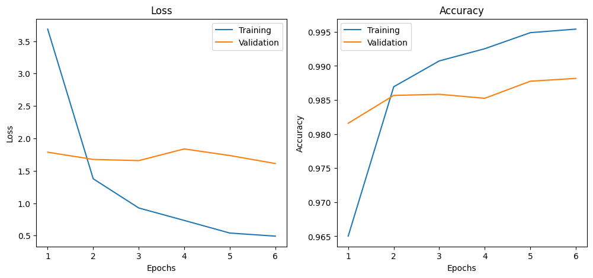
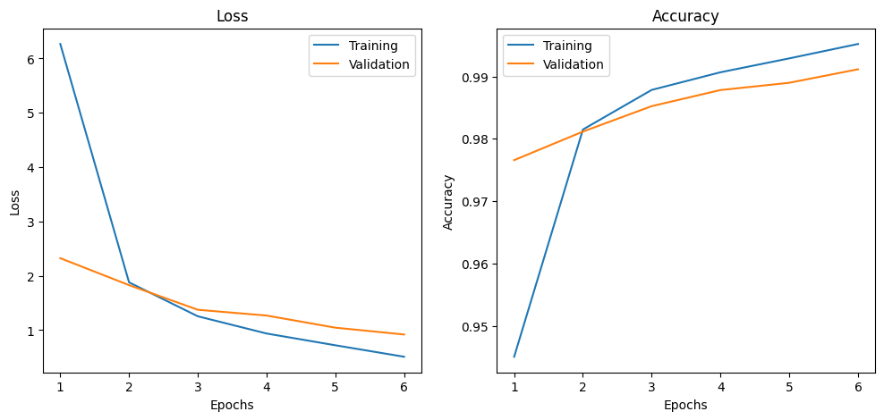
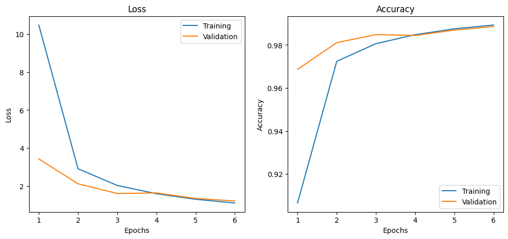
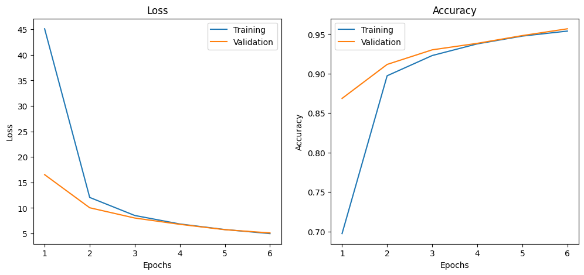
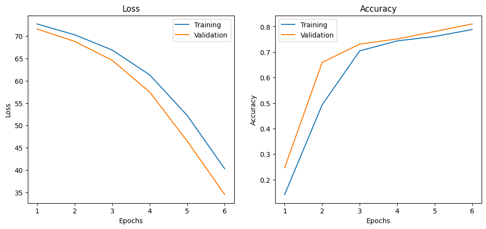

## Testes EX_5

>Otimizador: Adam ||
Learning rate = 0.001 ||
Acurácia do Modelo em 10k imagens de teste: 98.83

>Otimizador: Adam ||
Learning rate = 0.0001 ||
Acurácia do Modelo em 10k imagens de teste: 99.22

>Otimizador: SGD ||
Learning rate = 0.01 ||
Acurácia do Modelo em 10k imagens de teste: 99.02

>Otimizador: SGD ||
Learning rate = 0.001 ||
Acurácia do Modelo em 10k imagens de teste: 95.85

>Otimizador: SGD ||
Learning rate = 0.0001 ||
Acurácia do Modelo em 10k imagens de teste: 81.09

## 6 - Qual a diferença entre os modos model.train() e model.eval()? Por que é crucial usar model.eval() e com torch.no_grad() durante a fase de teste/avaliação?

>`model.train()` configura o modelo no modo de treinamento, ativando comportamentos específicos de camadas como o Dropout, que desativa aleatoriamente neurônios para fins de regularização, e o Batch Normalization, que utiliza a média e variância do batch atual para normalizar as ativações. Já `model.eval()` coloca o modelo no modo de avaliação, desativa o Dropout e faz com que o Batch Normalization utilize as estatísticas globais acumuladas durante o treinamento, garantindo estabilidade na inferência.

>Durante a fase de teste/avaliação, é crucial usar with `torch.no_grad()`, que desativa o cálculo de gradientes, reduz o consumo de memória e melhora a eficiência computacional, já que os gradientes não são necessários fora do treinamento.   